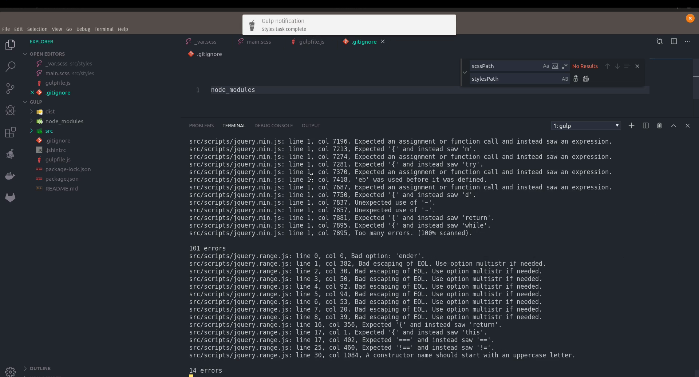

# gulp-4-starter
 
# 
#gulp ^4.0.2

## Getting Started
gulp 4 clean starter to optimize css and js . 
```
Concatenation.
Minification.
Purify.
```
### Prerequisites

#How to use
```
Clone the repository with git clone : 
Run npm install
```
## Authors
Nizar Marzouki
